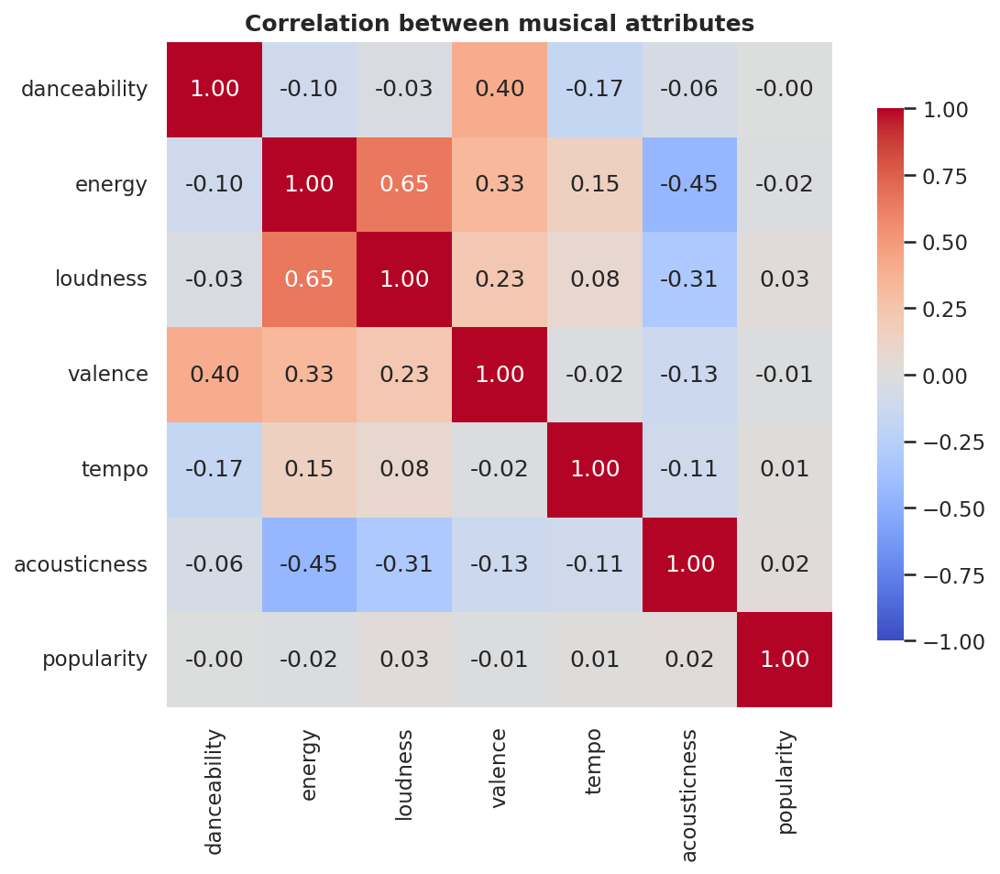
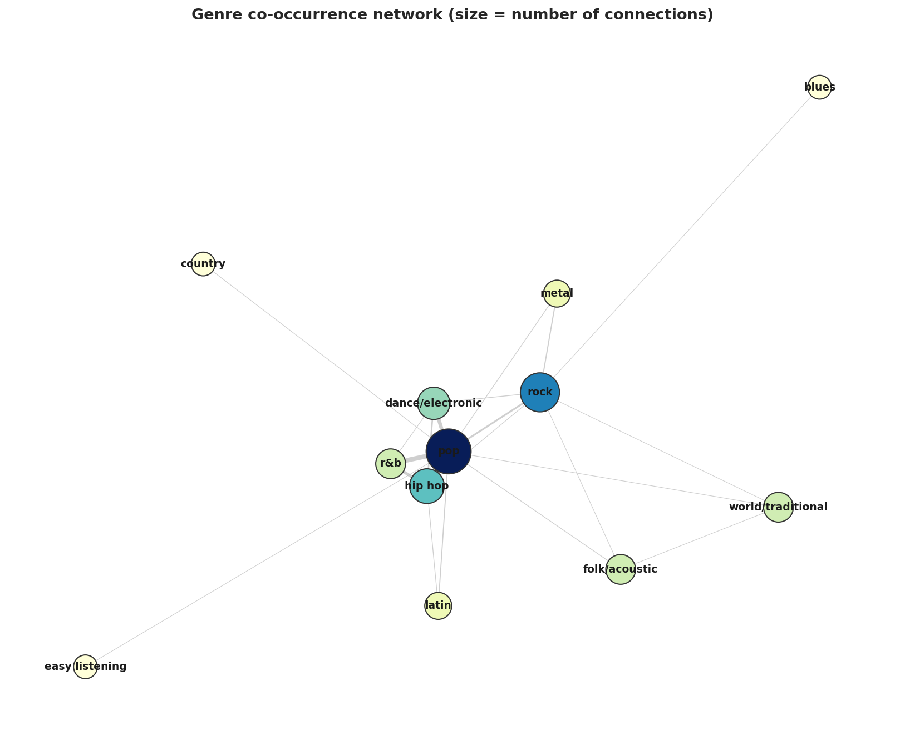
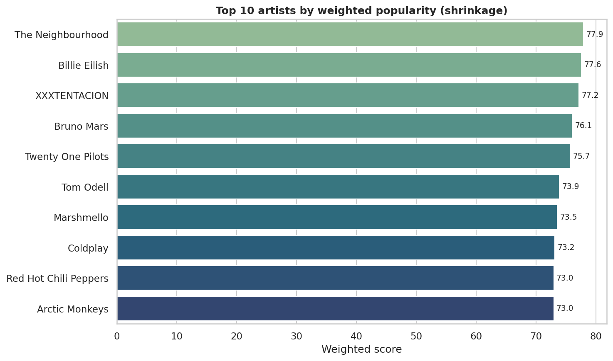
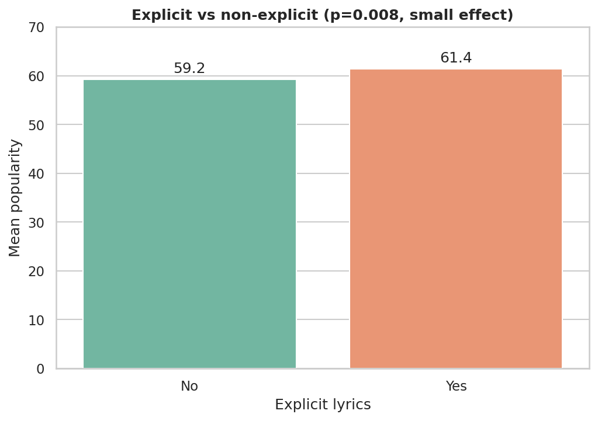

# Spotify Song Analysis

Exploratory data analysis of ~2,000 popular songs (1999–2019) and their Spotify
audio features. The project asks a simple question — **what makes a song
popular?** — and answers it with a small, tested, reproducible pipeline rather
than a single monolithic notebook.

> This is a general data-science / EDA project. My main line of work is
> geospatial / Earth observation (see pinned repositories); this one is here to
> show a clean, end-to-end analytical workflow on tabular data.

## Key findings

- **Audio features do not predict popularity.** Cross-validated R² for both a
  linear model and a Random Forest is ≈ 0. Popularity is driven by factors
  outside these columns (marketing, artist reach, playlisting).
- **Explicit tracks are *slightly* more popular** — statistically significant
  (p < 0.01) but a small effect (~2 points), a nice illustration of
  *significant ≠ important* with a large sample.
- **Fair artist/genre ranking** via Bayesian shrinkage instead of a naive
  `mean × log(n)` weighting (which zeroed out ~59% of artists — see below).
- `hip hop` + `pop` is the dominant genre co-occurrence; rock anchors the network.

## Highlights

Audio features barely correlate with popularity — the strongest is loudness, and
even that is weak:



Genres form a clear network, with `pop` at the centre and `rock` / `hip hop` as
the main connectors (node size = number of connections):



<details>
<summary>More figures</summary>

Fairly-ranked top artists (Bayesian shrinkage, not the broken <code>log(n)</code>):



Explicit tracks are significantly but only slightly more popular:



</details>

> The genre network and the temporal-evolution chart are interactive (Plotly) in
> the notebook. GitHub does not render Plotly in the static viewer, so static PNGs
> are shown here — run the notebook for the interactive versions.

## Project structure

```
spotify-song-analysis/
├── README.md
├── requirements.txt
├── pyproject.toml
├── data/
│   └── songs.csv
├── src/spotify_analysis/      # tested logic, imported by the notebook
│   ├── data.py                # load + clean
│   ├── features.py            # genre normalisation, duration
│   ├── analysis.py            # scoring, hypothesis tests, modelling
│   └── viz.py                 # plotting helpers
├── notebooks/
│   └── spotify_analisis.ipynb # orchestration + narrative + plots
├── tests/
│   └── test_pipeline.py       # pytest, incl. a regression test for the bug below
├── assets/                    # static PNGs for this README
└── results/
```

## Reproduce

```bash
git clone https://github.com/jpsicilia/spotify-song-analysis.git
cd spotify-song-analysis
pip install -r requirements.txt
pip install -e .                 # makes `import spotify_analysis` work anywhere

pytest tests/ -v                 # run the tests
jupyter lab notebooks/spotify_analisis.ipynb   # run the analysis
```

## A note on the scoring fix

The original ranking weighted each artist's mean popularity by `log(n)`, where
`n` is their number of songs. Because `log(1) = 0`, **every artist with a single
song scored exactly zero** and disappeared from the ranking — that is ~59% of the
835 artists, including one with a single song at popularity 88. The pipeline now
uses an IMDB-style shrinkage estimator:

```
score = (n · group_mean + m · global_mean) / (n + m)
```

which pulls sparsely-supported groups toward the global mean instead of deleting
them, giving every group a finite, comparable score. `tests/test_pipeline.py`
includes a regression test asserting single-song artists keep a positive score.

## Data

`data/songs.csv` — ~2,000 tracks with artist, title, year, popularity, and the
standard Spotify audio features (danceability, energy, valence, tempo, etc.).

<!-- TODO: paste the original data source here, e.g. the Kaggle dataset URL -->
Source: Kaggle

## License

MIT
